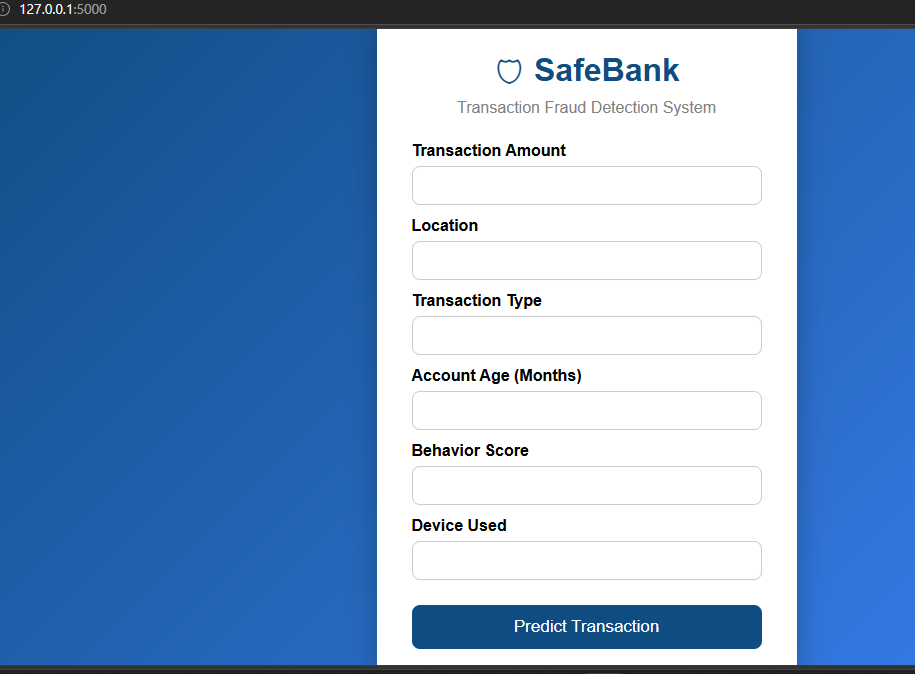
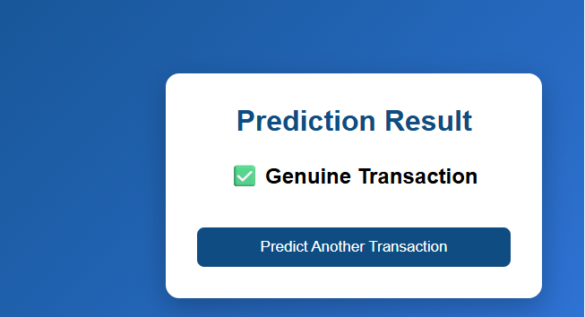
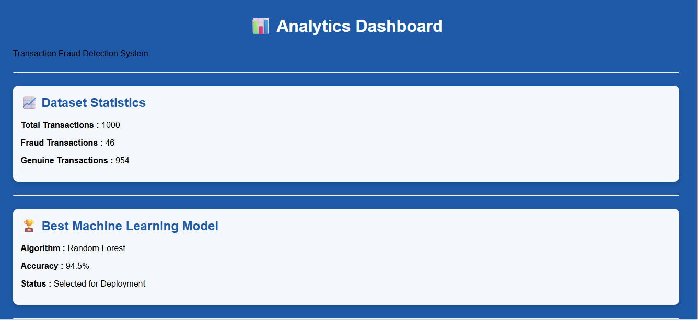

# 🛡️ Transaction Fraud Detection using Machine Learning

## 📖 Overview

Transaction Fraud Detection is a Machine Learning project developed to identify whether a banking transaction is **Fraudulent** or **Genuine** based on transaction details. The project applies data preprocessing, feature scaling, multiple machine learning algorithms, and a Flask web application to provide real-time fraud prediction along with an analytics dashboard.

---

## 🎯 Problem Statement

Financial fraud has become one of the major challenges faced by banks and financial institutions. Detecting fraudulent transactions manually is difficult due to the increasing number of daily transactions.

The objective of this project is to develop a Machine Learning model that accurately classifies transactions as **Fraudulent** or **Genuine** and provides live predictions through a web-based application.

---

## 🎯 Objectives

- Load and understand the transaction dataset.
- Perform data preprocessing and cleaning.
- Encode categorical features.
- Scale numerical features.
- Train multiple Machine Learning models.
- Compare model performance.
- Select the best-performing model.
- Build a Flask web application for live predictions.
- Develop an Analytics Dashboard for visualization.

---

# 🛠️ Technologies Used

### Programming Language
- Python

### Libraries
- Pandas
- NumPy
- Matplotlib
- Scikit-learn
- Joblib

### Web Technologies
- Flask
- HTML5
- CSS3

### Development Tools
- Jupyter Notebook
- Visual Studio Code
- Git & GitHub

---

# 🤖 Machine Learning Algorithms

The following Machine Learning algorithms were implemented and compared:

- K-Nearest Neighbors (KNN)
- Decision Tree
- Random Forest
- Naive Bayes
- Ensemble Learning (Voting Classifier)

**Best Performing Model:** Random Forest

---

# 📂 Project Structure

```
Transaction-Fraud-Detection
│
├── app
│   ├── app.py
│   └── static
│       ├── accuracy.png
│       ├── pie.png
│       ├── style.css
│       └── dashboard.css
│
├── data
│   └── Transaction Fraud Detection for SafeBank.csv
│
├── models
│   ├── fraud_model.pkl
│   └── scaler.pkl
│
├── notebooks
│   └── Fraud_Detection.ipynb
│
├── outputs
│   ├── home_page.png
│   ├── prediction_result.png
│   └── dashboard.png
│
├── templates
│   ├── index.html
│   ├── result.html
│   └── dashboard.html
│
├── requirements.txt
│
└── README.md
```

---

# ⚙️ Project Workflow

```
Transaction Dataset
        │
        ▼
Data Cleaning
        │
        ▼
Feature Encoding
        │
        ▼
Feature Scaling
        │
        ▼
Train Machine Learning Models
        │
        ▼
Model Evaluation
        │
        ▼
Random Forest Selected
        │
        ▼
Save Model (.pkl)
        │
        ▼
Flask Web Application
        │
        ▼
Analytics Dashboard
        │
        ▼
Live Fraud Prediction
```

---

# 📊 Dataset Information

The dataset contains transaction details such as:

- Transaction Amount
- Location
- Transaction Type
- Account Age (Months)
- Behavior Score
- Device Used
- Fraud Label (Target Variable)

Target Variable:

- **0 → Genuine Transaction**
- **1 → Fraudulent Transaction**

---

# 📈 Model Performance

| Algorithm | Accuracy (%) |
|------------|-------------:|
| K-Nearest Neighbors | 94.5 |
| Decision Tree | 86.5 |
| Random Forest | 94.5 |
| Naive Bayes | 94.5 |
| Ensemble Learning | 94.5 |

**Selected Model:** Random Forest

---

# 🌟 Features

- Data Cleaning
- Feature Encoding
- Feature Scaling
- Multiple Machine Learning Algorithms
- Model Comparison
- Fraud Prediction
- Flask Web Application
- Analytics Dashboard
- Accuracy Comparison Chart
- Fraud Distribution Chart
- Interactive User Interface

---

# 🖥️ Application Modules

### 🏠 Home Page

Allows users to enter transaction details.

---

### 🤖 Fraud Prediction

Predicts whether the transaction is Fraudulent or Genuine.

---

### 📊 Analytics Dashboard

Displays:

- Total Transactions
- Fraud Transactions
- Genuine Transactions
- Accuracy Comparison
- Fraud Distribution
- Model Performance

---

# 🚀 Installation

## Clone the repository

```bash
git clone https://github.com/your-username/Transaction-Fraud-Detection.git
```

---

## Move to project directory

```bash
cd Transaction-Fraud-Detection
```

---

## Install dependencies

```bash
pip install -r requirements.txt
```

---

## Run the Flask Application

```bash
cd app
python app.py
```

---

## Open in Browser

```
http://127.0.0.1:5000
```

---

## 📷 Screenshots

### 🏠 Home Page



### ✅ Prediction Result



### 📊 Analytics Dashboard




---

# 🔮 Future Scope

The project can be enhanced further by integrating:

- Deep Learning models for higher prediction accuracy.
- Real-time fraud detection using streaming transaction data.
- Natural Language Processing (NLP) for analyzing customer complaints and transaction descriptions.
- Computer Vision for identity verification using documents or facial recognition.
- Cloud deployment using AWS, Azure, or Render.
- AI-based customer risk profiling.
- Mobile application integration.

---

# 📌 Conclusion

This project successfully demonstrates the application of Machine Learning techniques for detecting fraudulent banking transactions. Multiple classification algorithms were implemented and evaluated, with Random Forest selected as the best-performing model. A Flask-based web application and analytics dashboard provide an interactive interface for real-time fraud prediction and visualization.

---

# 👩‍💻 Author

**Varshitha**

Bachelor of Technology (B.Tech)

Machine Learning Project

---

# ⭐ Acknowledgements

- Scikit-learn Documentation
- Flask Documentation
- Pandas Documentation
- Matplotlib Documentation
- Python Community
